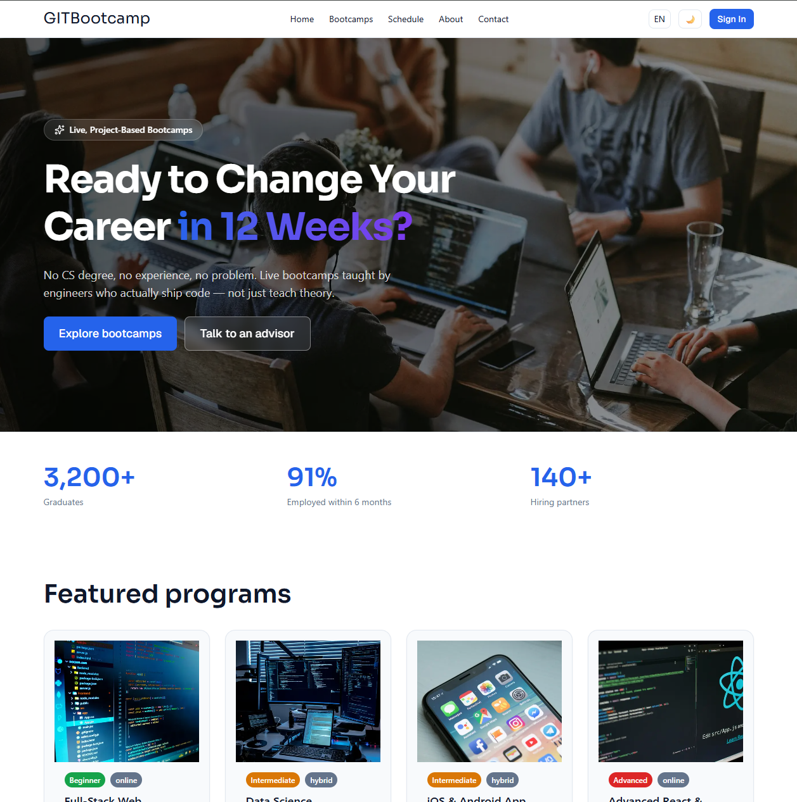
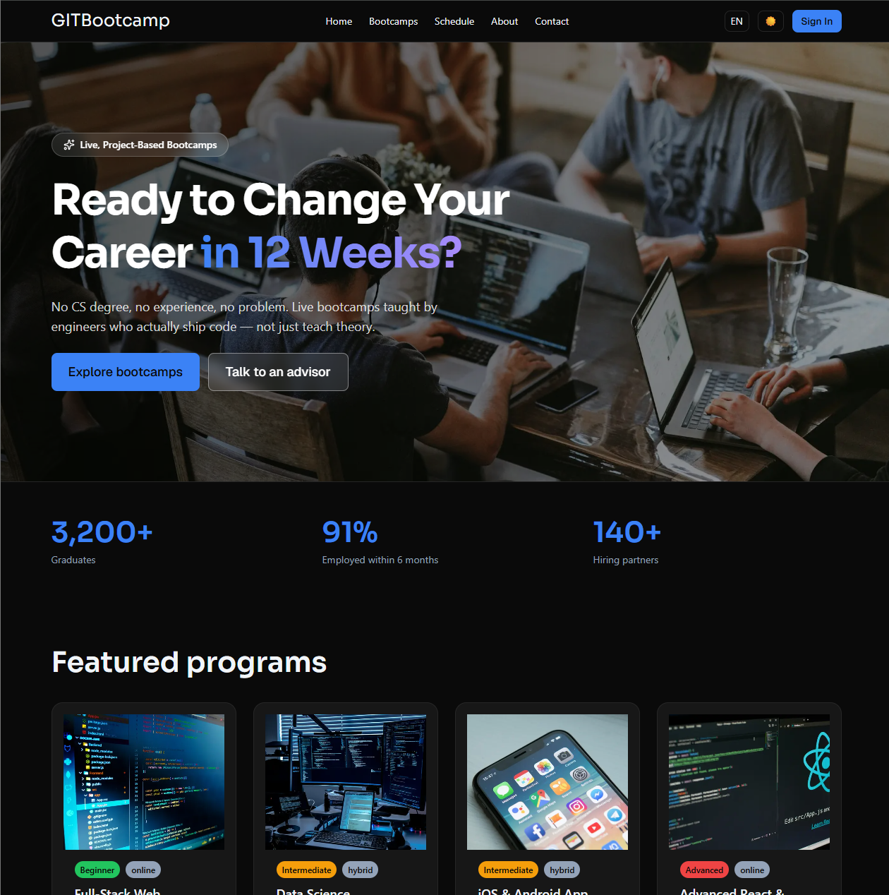
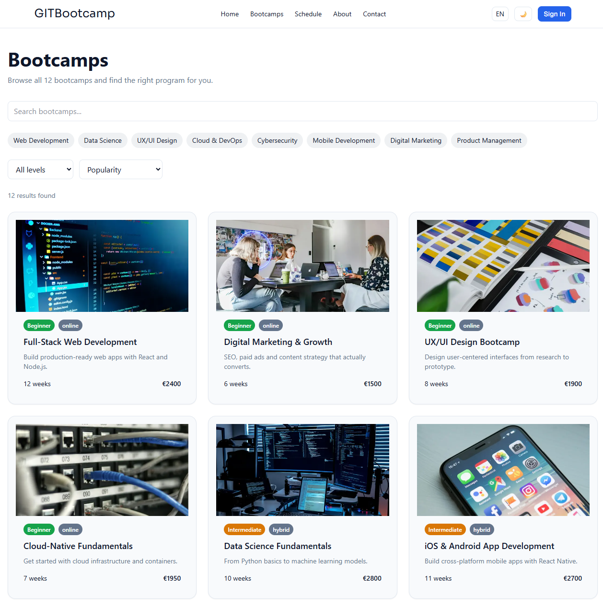
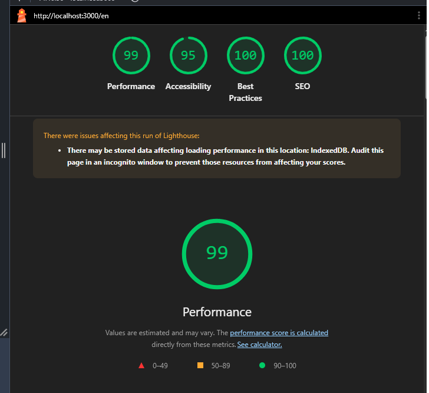
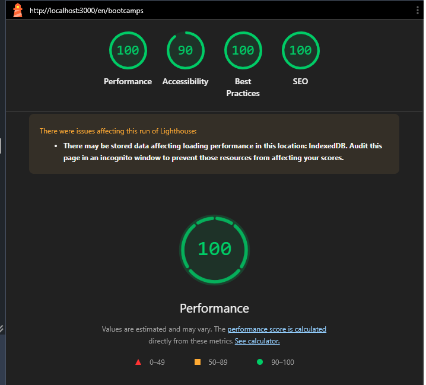
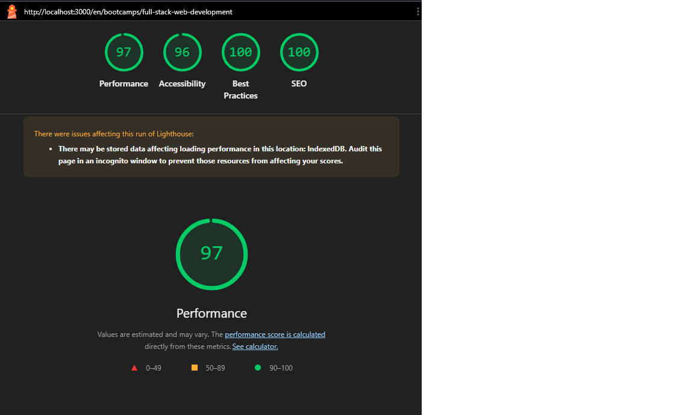

# GITB-CAPSTONE-01 — GITBootcamp

A fully rebuilt, bilingual (EN/TR) bootcamp platform frontend, built from scratch for the Global IT Bootcamp frontend capstone project. Built with Next.js App Router, TypeScript, and Tailwind CSS v4.

**Live demo:** [gitb-capstone-01.vercel.app](https://gitb-capstone-01.vercel.app)

---

## Table of Contents

- [Project Overview](#project-overview)
- [Tech Stack](#tech-stack)
- [Getting Started](#getting-started)
- [Folder Structure](#folder-structure)
- [Architecture Decisions](#architecture-decisions)
- [Libraries Used](#libraries-used)
- [Lighthouse Audit](#lighthouse-audit)
- [Known Issues / Limitations](#known-issues--limitations)
- [Team & Responsibilities](#team--responsibilities)

---

## Project Overview

A ground-up rebuild of the frontend for Global IT Bootcamp's existing bootcamp platform. Backend, database, and real authentication are out of scope — all data comes from typed mock data files.

**Pages:** Landing, Bootcamps (list + filters), Bootcamp Detail, Schedule, About, Contact, Login, Register, 404.

**Features:** Bilingual support (EN/TR), dark/light mode, responsive design, page transition animations, scroll reveal animations, cookie consent banner, form validation, loading/error states, SEO metadata (sitemap, robots, Open Graph).

### Screenshots

**Landing (light mode)**



**Landing (dark mode)**



**Bootcamps list**



---

## Tech Stack

| Layer           | Technology                                                                       |
| --------------- | -------------------------------------------------------------------------------- |
| Framework       | Next.js 16.3 (App Router)                                                        |
| Language        | TypeScript (strict mode)                                                         |
| UI              | React 19, functional components + hooks                                          |
| Styling         | Tailwind CSS v4 (CSS-first config)                                               |
| i18n            | next-intl                                                                        |
| Animation       | Framer Motion                                                                    |
| Icons           | lucide-react (+ hand-written inline SVGs, see [Libraries Used](#libraries-used)) |
| Package manager | npm                                                                              |
| Deploy          | Vercel                                                                           |

---

## Getting Started

```bash
# Clone the repo
git clone https://github.com/muhammeta55/gitb-capstone-01.git
cd gitb-capstone-01

# Install dependencies
npm install

# Start the dev server
npm run dev
```

Open `http://localhost:3000` in your browser — you'll be redirected to `/en` automatically.

### Other commands

```bash
npm run build   # Production build
npm run start   # Run the production build (after building)
npm run lint    # Run ESLint
```

> **Note:** Some bugs (especially production-only issues) only surface with `npm run build && npm run start` — they won't appear under `npm run dev`. It's worth running a production build occasionally, not just relying on dev mode.

---

## Folder Structure

```
src/
├── app/
│   ├── layout.tsx              # Root layout — <html>/<body>, theme flash-prevention script
│   ├── sitemap.ts               # Generates /sitemap.xml
│   ├── robots.ts                # Generates /robots.txt
│   ├── opengraph-image.tsx      # Dynamic OG image generation
│   ├── not-found.tsx            # Root-level 404 (for routes outside any locale)
│   └── [locale]/
│       ├── layout.tsx           # Locale-aware layout — Header, Footer, PageTransition, CookieConsent
│       ├── page.tsx             # Landing page
│       ├── not-found.tsx        # In-locale 404
│       ├── bootcamps/
│       │   ├── page.tsx         # List + filters
│       │   └── [slug]/page.tsx  # Detail page (dynamic route)
│       ├── about/, contact/, schedule/, login/, register/
│       └── styleguide/          # Visual reference for design tokens
├── components/
│   ├── ui/                      # Shared primitives: Button, Card, Input, Badge, Accordion, etc.
│   ├── layout/                  # Header, Footer, MobileMenu, ThemeToggle, LanguageSwitcher, CookieConsent, PageTransition, ScrollReveal
│   ├── landing/, bootcamps/, about/, contact/, schedule/, auth/
│   └── ThemeHtmlSync.tsx, LocaleHtmlSync.tsx  # DOM sync components (see Architecture Decisions)
├── data/                        # Typed mock data (bootcamps, categories, instructors, cohorts, testimonials, pricingPlans)
├── types/                       # Shared TypeScript interfaces
├── hooks/                       # useFilters, useCountdown
├── lib/                         # filterBootcamps.ts and other helpers
├── i18n/                        # next-intl routing, navigation, request config
└── middleware.ts                # Locale detection and routing

messages/
├── en.json
└── tr.json
```

---

## Architecture Decisions

### Design Token System

All colors, typography, spacing, and radius values are centrally defined in `globals.css` using Tailwind v4's `@theme inline` syntax. No component uses hardcoded hex colors — see `/styleguide` for a visual reference.

### i18n Structure

Every page lives under a `[locale]` dynamic segment. Middleware automatically redirects `/` requests to `/en` or `/tr`. The root `layout.tsx` stays minimal (just `<html>`/`<body>`); the real content lives in `[locale]/layout.tsx`.

### Theme and Locale DOM Sync

`ThemeHtmlSync` and `LocaleHtmlSync` are components that render no UI and stay mounted at all times. They sync the `class` (dark mode) and `lang` attributes on `document.documentElement` on every route change. This pattern was specifically chosen to avoid sync conflicts caused by theme/language toggle buttons being rendered in more than one place (desktop header + mobile menu) — previously, keeping that state in separate component instances caused brief "flash" glitches during page transitions.

### Static Generation and i18n

The bootcamp detail page (`[locale]/bootcamps/[slug]`) generates both `locale` and `slug` combinations in `generateStaticParams`. Returning only `slug` caused a production `DYNAMIC_SERVER_USAGE` error and locale content getting "stuck" on whichever locale rendered first — an important Next.js behavior to watch for on routes with more than one dynamic segment.

### Component Reuse

Primitives like `Button`, `Card`, `Input`, and `Badge` live centrally in `src/components/ui/`. Page-specific components (`BootcampCard`, `ContactForm`, etc.) wrap them rather than rebuilding them.

---

## Libraries Used

| Library           | Why it was chosen                                                                                                                                                                                                                                             |
| ----------------- | ------------------------------------------------------------------------------------------------------------------------------------------------------------------------------------------------------------------------------------------------------------- |
| **next-intl**     | Best-supported i18n solution for App Router; middleware-based locale routing with clean server/client component separation                                                                                                                                    |
| **Framer Motion** | Used for page transitions and scroll animations. With multiple team members writing animation code, a consistent API and built-in `prefers-reduced-motion` support (`useReducedMotion`) made it the safer choice                                              |
| **lucide-react**  | Lightweight, tree-shaken icon library for general-purpose icons. **Note:** version 1.0 removed all brand/logo icons (GitHub, LinkedIn, Twitter, etc.) — so the footer's social icons are hand-written inline SVGs instead of relying on an additional package |

---

## Lighthouse Audit

This project is periodically audited with [Lighthouse](https://developer.chrome.com/docs/lighthouse/overview/) to track performance, accessibility, best practices, and SEO scores.

To run a local audit:

```bash
npm run build
npm run start
npx lighthouse http://localhost:3000 --view
```

### Latest Scores

Tested locally against a **production build**, using Chrome DevTools Lighthouse (Desktop, Navigation mode). Three representative pages were audited to cover different risk areas: static content, client-side data/interactivity, and dynamic routing.

| Page                                                         | Performance | Accessibility | Best Practices | SEO |
| ------------------------------------------------------------ | ----------- | ------------- | -------------- | --- |
| Landing (`/en`)                                              | 99          | 95            | 100            | 100 |
| Bootcamps list (`/en/bootcamps`)                             | 100         | 90            | 100            | 100 |
| Bootcamp detail (`/en/bootcamps/full-stack-web-development`) | 97          | 96            | 100            | 100 |

> **Note:** The Bootcamps list page scores exactly 90 on Accessibility — passing, but with no margin. Worth revisiting before it silently regresses below the threshold.

> Scores last updated: 2026-08-10

### Screenshots

**Landing (`/en`)**



**Bootcamps list (`/en/bootcamps`)**



**Bootcamp detail (`/en/bootcamps/full-stack-web-development`)**



---

## Known Issues / Limitations

- **Cosmetic console warning:** The theme flash-prevention script triggers a known React 19 / Next.js 16.2+ false-positive warning ("Encountered a script tag...") during page transitions. The script works correctly, there's no visible flash, and it doesn't affect the production build.
- **Middleware → Proxy naming:** Next.js 16.3 renamed the `middleware.ts` convention to `proxy`. Current code still works, but may need migrating later (`npx @next/codemod@canary middleware-to-proxy .`).
- **Edge Runtime deprecation warning:** `opengraph-image.tsx` uses `runtime = "edge"`, which Next.js has marked deprecated. Works fine currently; migrating to the `nodejs` runtime could be considered later.
- **Course content is English-only:** Bootcamp titles/descriptions (mock data) are only in English; while UI text is fully translated, translating course content itself was out of scope — it would require restructuring the data model (e.g. `title: { en, tr }`).
- **No real authentication:** Login/Register forms work with mock data (sign in with `test@test.com` / `123456`; registering with that same email simulates an "already registered" error).

---

## Team & Responsibilities

| Role                                     | Person   | Area of Responsibility                                                                                           |
| ---------------------------------------- | -------- | ---------------------------------------------------------------------------------------------------------------- |
| R1 — Platform & Design System, Team Lead | Muhammet | Project setup, design tokens, shared UI components, layout, i18n/theme infrastructure, deployment, documentation |
| R2 — Marketing Pages                     | Neslihan | Landing, About, Contact, page transition and scroll animations                                                   |
| R3 — Product Pages                       | Sefa     | Bootcamps list/filters, Bootcamp detail, Schedule, Login/Register, 404, SEO, loading/error states                |

---

## Retro Notes

_(To be added before Demo Day: what went well, what didn't, what we'd change)_
